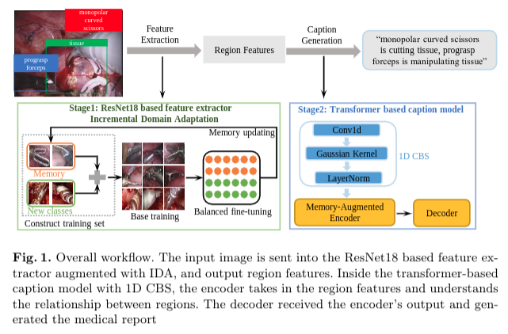
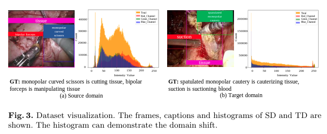
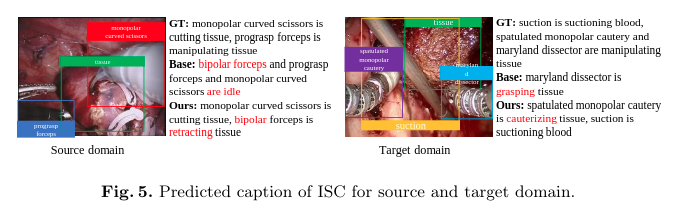

# CIDA for surgical report generation
This repository contains the reference code for the paper "Class-Incremental Domain Adaptation with Smoothing and Calibration for Surgical Report Generation"

<p align="center">
  
</p>

## Environment setup
Clone the repository and create the `m2release` conda environment using the `environment.yml` file:
```
conda env create -f environment.yml
conda activate m2release
```

Then download spacy data by executing the following command:
```
python -m spacy download en
```

Note: Python 3.6 is required to run our code.

If you face any issue when creating the environment, please refer to the [M2Transformer](https://github.com/aimagelab/meshed-memory-transformer)


## Preprocessing (Optional Step)
The codes in preprocessing folder are used to prepare the annotations files which store features path of each surgical image and corresponding caption. This step is optional, you can skip it and directly download the annotation folder according to the next step.

We split the train / val dataset for source domain dataset ([MICCAI EndoVisSub2018-RoboticSceneSegmentation](https://endovissub2018-roboticscenesegmentation.grand-challenge.org/Data/)) in CaptionCollection.py, and for target domain dataset (Transoral robotic surgery) in DACaptionCollection.py. You need to modify the dir_root_gt properly, switch between the two different seq_set and change the output file name correspondingly to get train dataset files and val dataset files. 

For each surgical image, we create a .xml file which stores the caption and coordinates of bounding boxes. CaptionCollection.py and DACaptionCollection.py read these .xml files and collect all captions and corresponding feature path into .json file.


Run `python Preprocessing/CaptionCollection.py` to get the train / val annotations files for source domain.

Run `python Preprocessing/DACaptionCollection.py` to get the train / val annotations files for target domain.

<p align="center">
  
</p>

## Data preparation
To run the code, annotations folder and features folder for the dataset are needed. 
Download [annotations folder](https://bit.ly/3v8K7e4)
Download [source domain validation dataset](https://bit.ly/3bHBNKH)
Download [target domain dataset](https://bit.ly/3f6JAnh)

## Feature extractor
ResNet18 is used to extract region features. We implement the Class-Incremental Domain Adaptation (CIDA) method to deal with the domain shift and the out-of-distribution (novel classes) problems. Please download our [pretrained feature extractor](https://bit.ly/3oCohNv)
If you want to train the model from the scratch (Optional Step),
Run `python3 FeatureExtractor/incremental_training_supcon.py --cbs True` 
Thw training process will take about 2 hours.

The next step is to extract the region features for dataset
Run `python3 roi_feature_extraction_resnet_supcon.py` 

## Evaluation
1) To reproduce the results of our model in source domain, download the pretrained model file [CIDA_MICCAI2021_checkpoints/inc_sup_cbs____cbs_ls/m2_transformer_best.pth](https://bit.ly/3fDETQO) 

Run `python3 val.py --features_path /xxx/instruments18_caption/ --annotation_folder annotations_new/annotations_SD_inc_sup_cbs --cbs True` 

You will get the validation results on source domain dataset.

2) To reproduce the few shot DA results of our model in target domain, download the pretrained model file [CIDA_MICCAI2021_checkpoints/few_shot_inc_sup_cbs____cbs_ls/m2_transformer_best.pth](https://bit.ly/3fDETQO) 

Run `python3 val.py --features_path /xxx/DomainAdaptation/ --annotation_folder annotations_new/annotations_TD_inc_sup_cbs`

3) To reproduce the results of the base model, download the pretrained model file on source domain [CIDA_MICCAI2021_checkpoints/baseline/m2_transformer_best.pth](https://bit.ly/3fDETQO) and model file on target domain [CIDA_MICCAI2021_checkpoints/few_shot_baseline/m2_transformer_best.pth](https://bit.ly/3fDETQO)

Run `python3 val.py --features_path /xxx/instruments18_caption/ --annotation_folder annotations_new/annotations_SD_baseline` 

## Training procedure
1) Run `python3 train.py --features_path /xxxx/instruments18_caption/ --annotation_folder annotations_new/annotations_SD_inc_sup_cbs --cbs True` to reproduce the source domain results from our model.

2) Load the saved best model from above step into DA.py and run `python3 DA.py --features_path /xxxx/DomainAdaptation/ --annotation_folder annotations_new/annotations_TD_inc_sup_cbs` to reproduce the few shot DA results from our model.

<p align="center">
  
</p>


## Acknowledgements
Thanks the contribution of [M2Transformer](https://github.com/aimagelab/meshed-memory-transformer)


